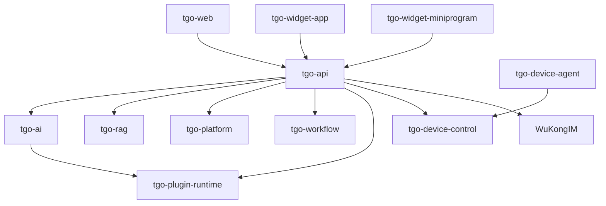

# TGO Workspace — AGENTS.md

> 最近校准: 2026-03-11

## Rules (按优先级排列)

- Before editing runtime, API, or cross-service code, run `bash .skills/implementation-strategy/scripts/analyze.sh`
- If the change affects any code in `repos/*/`, run `bash .skills/code-change-verification/scripts/verify.sh` when done
- If the change touches `models/*.py` or `models/**/*.py`, run `bash .skills/db-migration-check/scripts/check.sh`
- If the change affects schemas, types, or API response structures, run `bash .skills/cross-service-sync/scripts/check.sh`
- If the change touches streaming, SSE, WuKongIM, or json-render code, run `bash .skills/streaming-protocol-check/scripts/check.sh`
- When work is finished and ready to commit, run `bash .skills/pr-draft-summary/scripts/summary.sh`
- Always read the target service's `AGENTS.md` before making changes

## Architecture



## Services

| Service | Dir | Role | Port |
|:--------|:----|:-----|:-----|
| tgo-api | `repos/tgo-api` | Core API gateway, multi-tenant | 8000 |
| tgo-ai | `repos/tgo-ai` | LLM, Agent runtime | 8081 |
| tgo-rag | `repos/tgo-rag` | Knowledge base, RAG | 18082 |
| tgo-platform | `repos/tgo-platform` | Channel message sync | 8003 |
| tgo-workflow | `repos/tgo-workflow` | Workflow engine | 8004 |
| tgo-plugin-runtime | `repos/tgo-plugin-runtime` | Plugin & MCP runtime | 8090 |
| tgo-device-control | `repos/tgo-device-control` | Device management | 8085 |
| tgo-device-agent | `repos/tgo-device-agent` | Device-side Go agent | N/A |
| tgo-web | `repos/tgo-web` | Admin frontend | 5173 |
| tgo-widget-app | `repos/tgo-widget-app` | Visitor chat widget | 5174 |
| tgo-widget-miniprogram | `repos/tgo-widget-miniprogram` | WeChat mini-program widget | N/A |
| tgo-cli | `repos/tgo-cli` | Staff CLI + MCP server | N/A |
| tgo-widget-cli | `repos/tgo-widget-cli` | Visitor CLI + MCP server | N/A |

Infra: PostgreSQL + pgvector, Redis, WuKongIM, Celery (RAG/Workflow workers)

## Constraints

- No bare `dict` (Python) or `any` (TypeScript) in business interfaces
- No cross-service direct DB access — use HTTP clients in `services/`
- No hardcoded URLs, secrets, or environment addresses — use `.env` + config
- Model/table changes must include Alembic migration
- Migration and code must be committed together

## Tech Stack

- Backend: Python 3.11, FastAPI, SQLAlchemy 2, Alembic, Pydantic v2
- Frontend: tgo-web (React 19 + TS + Vite 7 + Zustand), tgo-widget-app (React 18 + TS + Vite 5)
- Device: Go 1.22 (tgo-device-agent)
- Mini-program: Pure JS (ES5), WeChat native components

## Quick Start

```bash
cp .env.dev.example .env.dev && make install
make infra-up && make migrate
make dev-api    # or: make dev-all
```

## Service AGENTS.md Entry Points

- [`repos/tgo-ai/AGENTS.md`](repos/tgo-ai/AGENTS.md)
- [`repos/tgo-api/AGENTS.md`](repos/tgo-api/AGENTS.md)
- [`repos/tgo-web/AGENTS.md`](repos/tgo-web/AGENTS.md)
- [`repos/tgo-rag/AGENTS.md`](repos/tgo-rag/AGENTS.md)
- [`repos/tgo-platform/AGENTS.md`](repos/tgo-platform/AGENTS.md)
- [`repos/tgo-workflow/AGENTS.md`](repos/tgo-workflow/AGENTS.md)
- [`repos/tgo-plugin-runtime/AGENTS.md`](repos/tgo-plugin-runtime/AGENTS.md)
- [`repos/tgo-device-control/AGENTS.md`](repos/tgo-device-control/AGENTS.md)
- [`repos/tgo-device-agent/AGENTS.md`](repos/tgo-device-agent/AGENTS.md)
- [`repos/tgo-widget-app/AGENTS.md`](repos/tgo-widget-app/AGENTS.md)
- [`repos/tgo-widget-miniprogram/AGENTS.md`](repos/tgo-widget-miniprogram/AGENTS.md)
- [`repos/tgo-cli/AGENTS.md`](repos/tgo-cli/AGENTS.md)
- [`repos/tgo-widget-cli/AGENTS.md`](repos/tgo-widget-cli/AGENTS.md)
